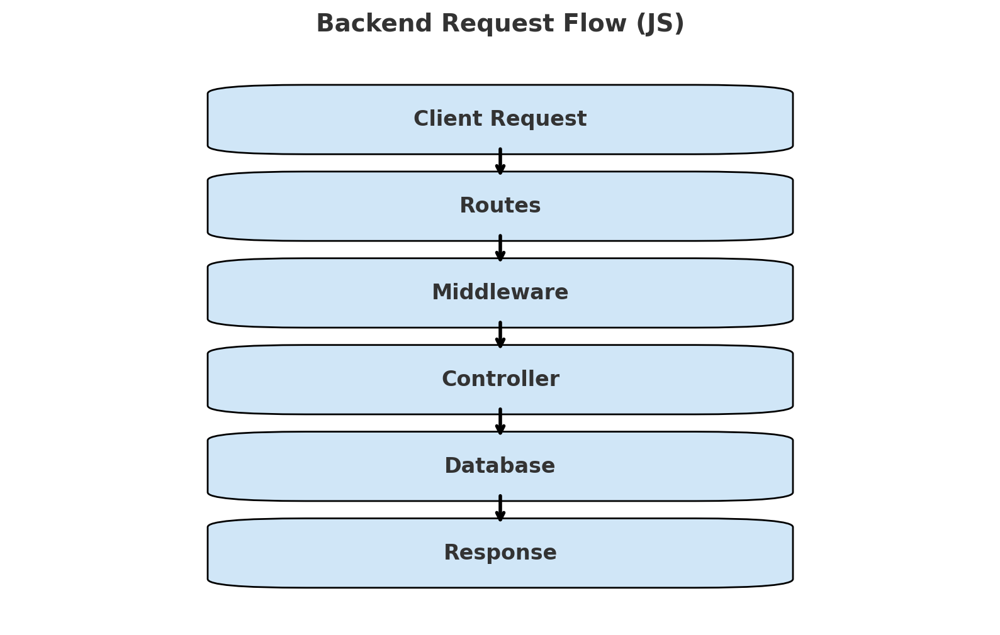

# 🚀 JavaScript Backend Development Roadmap

> **Goal:** Focus purely on backend logic with a strong foundation in one programming language.

---

## 📌 Core Components of Backend Development

### 1. Programming Language & Framework

Choose one language and stick with it until your fundamentals are clear.

* **Languages:** `Java`, `JavaScript`, `PHP`, `Go`, `Python`
* **Frameworks / Runtimes:**

  * Java → Spring Boot
  * JavaScript → Node.js, Bun, Deno
  * Python → Django, Flask

### 2. Database

Every backend interacts with a database. Learn at least one relational and one non-relational DB.

* **Relational:** `MySQL`, `PostgreSQL`, `SQLite`
* **NoSQL:** `MongoDB`
* **With Abstraction Layer:** ORM (e.g., Sequelize, TypeORM) | ODM (e.g., Mongoose)

---

## ⚡ What You’ll Always Deal With in Backend

1. **Data** (CRUD operations, DB queries)
2. **Files** (uploads, storage, serving static files)
3. **Third-party APIs** (REST APIs, SDK integrations, webhooks)

---

Here’s a **visual flowchart** of how a request moves through a JavaScript backend 🚀:




* **Client Request → Routes → Middleware → Controller → Database → Response**


## 🖥️ JavaScript Runtimes

* **Node.js** → Most popular for backend
* **Bun** → Fast, modern runtime
* **Deno** → Secure, TypeScript-first runtime

---

## 📂 Standard Backend File Structure (JavaScript)

Everything lives under the `src/` directory.

```
project-root/
│── package.json
│── .env
│── README.md
│── .gitignore
│── .eslintrc.js  (optional: linting config)
│── .prettierrc   (optional: formatting config)
│
└── src/
    │── index.js        # Entry point (DB connects, server starts)
    │── app.js          # App config (middlewares, parsers, etc.)
    │── constants.js    # Constants, enums, DB names
    │
    ├── db/             # Database connection & config
    ├── models/         # Database models (schemas)
    ├── controllers/    # Business logic
    ├── routes/         # API routes
    ├── middlewares/    # Auth, logging, validation
    ├── utils/          # Helper functions, utilities
    └── more/           # Extra features (services, jobs, etc.)
```

---

## ✅ Quick Tips for Daily Practice

* Keep your **language basics crystal clear** (data types, functions, OOP, async/await).
* Focus on **backend-specific logic**, not UI.
* Learn **how to structure clean projects** (readable, modular, scalable).
* Practice **database queries daily** (both SQL and NoSQL).
* Always **test your APIs** (Postman, Thunder Client, curl).

---

